# Course Configuration Control Plane Specification (Gradescope MVP)

- Status: Authoritative MVP product and integration specification
- Specification version: `course-config-spec/v1`
- Last updated: 2026-07-09
- Audience: Product, frontend, backend, GradeSync, and Gradescope Handler owners

This document is the source of truth for the Course Configuration MVP. The
[Berkeley CS Course Harness Design](./berkeley-cs-course-harness.md) remains
useful background research, but this specification wins wherever the two
documents conflict.

## 1. Decision Summary

The MVP is a Gradescope-only course configuration control plane.

- GradeView provides the web authoring experience, CSV import/export, the
  canonical Course Blueprint DSL, validation, immutable revisions, change
  plans, approval, runtime activation, drift reporting, and audit history.
- A separate Gradescope Handler executes normalized Gradescope jobs and returns
  normalized results. Its login method, browser automation, private endpoints,
  retries against Gradescope, and other implementation details are out of scope.
- The web page is the primary editor. CSV is a low-friction bulk editor for
  assignments only. CSV is never a runtime configuration source.
- A published and successfully applied Course Blueprint revision is the only
  active runtime configuration.
- A stable `assignment_key` connects outbound assignment provisioning,
  Gradescope bindings, inbound grades, category membership, and Grade Data Flow.

## 2. Normative Language and Change Control

The words `MUST`, `MUST NOT`, `SHOULD`, `SHOULD NOT`, and `MAY` are normative.

To prevent requirement drift:

1. Semantic changes to this specification MUST change the specification version.
2. Field meanings and enum meanings MUST NOT change silently within a version.
3. Every published Course Blueprint MUST declare its schema version.
4. Handler requests and responses MUST declare their protocol version.
5. Examples in this document and the demo CSV MUST remain valid contract fixtures.
6. New behavior not covered here MUST be added to this document or to a linked,
   versioned specification before implementation is treated as complete.
7. Open implementation choices MAY vary only when they do not change an
   externally visible invariant or contract defined here.

## 3. Goals

The MVP MUST support the following outcome:

1. An instructor or course admin configures a course once in GradeView.
2. Repetitive assignment data can be entered in a spreadsheet and imported as CSV.
3. GradeView validates the complete course configuration before publication.
4. GradeView shows the exact Gradescope change plan before approval.
5. The Gradescope Handler creates, updates, or binds the required assignments.
6. GradeView records the returned external assignment IDs and observed state.
7. Existing GradeSync ingestion maps Gradescope grades back to the same logical
   assignments without relying on title matching.
8. Grade Data Flow uses the active policy revision and those logical assignments.
9. Partial failure, external edits, and retries are visible and auditable.

## 4. Non-Goals

The following are explicitly out of scope for this MVP:

- Implementing the Gradescope Handler.
- Defining how the Handler authenticates to Gradescope or handles SSO/2FA.
- Supporting Canvas, Blackboard, PrairieLearn, iClicker, GitHub Classroom, or
  any other platform.
- Automatically parsing a syllabus into a course policy.
- Using Google Sheets or CSV as a live runtime dependency.
- Managing rosters, sections, individual accommodations, or extensions.
- Creating Gradescope question content, outlines, rubrics, answer keys, or
  autograder internals beyond passing an opaque `template_ref`.
- Automatically deleting external Gradescope assignments.
- Automatically publishing grades back to Gradescope or an LMS.
- Replacing the current authoritative grade-summary calculations in the MVP.

## 5. Terms and Ownership

| Term | Meaning | Owner |
| --- | --- | --- |
| Course Blueprint | Versioned declarative desired state for one course | GradeView |
| Draft | Mutable, possibly invalid authoring state | GradeView |
| Revision | Immutable snapshot produced from a draft | GradeView |
| Active revision | Successfully applied revision used by runtime APIs | GradeView |
| Logical assignment | Platform-independent assignment identified by `assignment_key` | GradeView |
| Projection | Gradescope-specific desired state for a logical assignment | GradeView |
| Binding | Runtime link from `assignment_key` to Gradescope assignment ID | GradeView |
| Observed state | Normalized external state reported by the Handler | Gradescope Handler |
| Change plan | Frozen desired-vs-observed action list | GradeView |
| Drift | Difference between active managed fields and observed state | GradeView |
| Grade Data Flow | Explanation graph for the active grading policy and student data | GradeView |

Ownership rules:

- The active Course Blueprint is authoritative for managed fields.
- The Handler is authoritative only for what it observed and what it executed.
- A binding is operational state and MUST NOT be embedded in reusable DSL or CSV.
- Gradescope credentials and browser/session state MUST NOT be part of the DSL.
- External assignment IDs MUST NOT be used as logical assignment identity.
- The frontend MUST NOT implement grading or planning semantics independently.

## 6. System Invariants

These invariants are mandatory:

`INV-001` A course has at most one active Course Blueprint revision.

`INV-002` Published revisions are immutable. Editing creates a new draft.

`INV-003` Runtime APIs read only the active revision or its materialized
compatibility records. They never read CSV or a mutable draft.

`INV-004` `course_key`, `category_key`, `component_key`, and `assignment_key`
are stable identities. Display labels may change without changing identity.

`INV-005` Reimporting the same CSV into the same draft MUST NOT create duplicate
logical assignments.

`INV-006` A Handler action has an idempotency key. Retrying the same action MUST
not create a second external assignment.

`INV-007` A revision MUST NOT become active until all blocking Handler actions
succeed and post-apply observed state is verified.

`INV-008` If apply fails, the previous active revision remains the runtime source
of truth. The failed target remains visible and retryable.

`INV-009` Grade ingestion resolves a managed assignment through its binding.
Title/category matching is fallback behavior for legacy unmanaged assignments only.

`INV-010` Grade Flow totals MUST remain equal to the existing authoritative
Profile/Admin summary totals for the same active revision.

`INV-011` V1 never automatically deletes an external Gradescope assignment.

`INV-012` V1 never silently overwrites detected drift. Reconciliation requires a
reviewed change plan.

## 7. Architecture

```mermaid
flowchart LR
    UI["Course Config web UI"] --> Draft["Mutable blueprint draft"]
    CSV["Assignments CSV"] --> Import["CSV parser and merge"]
    Import --> Draft
    Draft --> Validate["Schema and semantic validation"]
    Validate --> Plan["Desired vs observed planner"]
    Handler["Gradescope Handler"] --> Observe["Observed Gradescope state"]
    Observe --> Plan
    Plan --> Review["Diff and approval"]
    Review --> Pending["Immutable pending revision and frozen plan"]
    Pending --> Handler
    Handler --> Verify["Result and post-apply verification"]
    Verify --> Materialize["Atomic compatibility materialization"]
    Materialize --> Active["Active blueprint revision"]
    Active --> GradeSync["Existing GradeSync ingestion"]
    GradeSync --> GradeFlow["Authoritative summary and Grade Data Flow"]
```



The Handler boundary is intentionally narrow. GradeView decides what should
exist; the Handler decides how to perform that work in Gradescope.

## 8. User Workflow

The Course Configuration page MUST use this workflow:

1. **Course** - Enter course identity, term, and timezone.
2. **Integrations** - Select or create the single Gradescope connection binding.
3. **Assignments** - Edit the assignment grid, paste rows, or import CSV.
4. **Grading** - Configure categories, components, grade bins, and policy flow.
5. **Review & Publish** - Validate, view the internal diff and Gradescope plan,
   acknowledge warnings, and publish/apply.

Draft behavior:

- Drafts MAY be incomplete or invalid and MAY be saved at any time.
- Every edit MUST update a deterministic `draft_hash`.
- Validation reports and plans MUST record the `draft_hash` they were built from.
- Editing after validation makes the previous validation and plan stale.
- Publishing a stale validation or stale plan MUST be rejected.

Publish behavior:

1. GradeView freezes the normalized DSL as an immutable pending revision.
2. GradeView freezes the approved change plan and its `plan_hash`.
3. GradeView submits the plan to the Handler after the database transaction commits.
4. GradeView records action-level progress and results.
5. GradeView performs post-apply observation.
6. GradeView materializes compatibility records for existing runtime paths.
7. The revision becomes active only if blocking actions match desired state and
   compatibility materialization succeeds.

## 9. Course Blueprint DSL

### 9.1 Canonical Format

The canonical representation MUST be normalized JSON stored in PostgreSQL.
YAML is used in documentation because it is easier to read. A web form, CSV
import, or future authoring surface MUST compile into the same canonical shape.

The DSL is declarative. It describes desired state and MUST NOT contain browser
steps, selectors, HTTP calls, credentials, or retry logic.

### 9.2 Top-Level Shape

```yaml
schema_version: course-blueprint/v1
course:
  key: cs10-sp27
  name: CS 10 Spring 2027
  department: COMPSCI
  course_number: "10"
  term: Spring
  year: 2027
  timezone: America/Los_Angeles

integration:
  provider: gradescope
  binding_key: gradescope-primary

categories:
  - key: labs
    label: Labs
    display_order: 10

assessments:
  - key: lab01
    title: Lab 01
    category_key: labs
    max_points: 10
    schedule:
      release_at: "2027-01-20T09:00:00-08:00"
      due_at: "2027-01-27T23:59:00-08:00"
      late_due_at: "2027-01-29T23:59:00-08:00"
    projection:
      type: programming
      uploader: student
      submission_mode: individual
      group_max_size: null
      time_limit_minutes: null
      provision_strategy: create_shell
      template_ref: null
    score:
      source: gradescope-primary
      component_key: labs

grading:
  mode: points
  total_points_cap: 400
  components:
    - key: labs
      label: Labs
      cap: 80
      assignment_selector:
        category_keys: [labs]
      pipeline:
        - op: sum
        - op: cap
          value: 80
  grade_bins:
    - grade: A
      min: 360
      max: 400
  total_pipeline:
    - op: sum_components
    - op: cap
      value: 400
    - op: grade_bin_lookup

sync_policy:
  drift_policy: alert
  destructive_changes: forbidden
```

### 9.3 Identity Rules

- Keys MUST match `^[a-z][a-z0-9_-]{0,63}$`.
- Keys MUST be unique within their entity type and course.
- Renaming a label or title MUST NOT change its key.
- Changing an `assignment_key` creates a new logical assignment. It is not rename.
- The course timezone is required and MUST be an IANA timezone name.
- Canonical timestamps MUST include an offset after normalization.

### 9.4 Assessment Rules

Each assessment MUST declare:

- Stable `key`.
- Non-empty `title`.
- Existing `category_key`.
- Numeric `max_points` greater than or equal to zero.
- Gradescope projection type.
- Provision strategy.
- Score source and target grading component, unless explicitly ignored.

Supported projection enums for V1:

- `type`: `programming`, `homework`, `exam`, `online`, `bubble_sheet`
- `uploader`: `student`, `instructor`
- `submission_mode`: `individual`, `group`
- `provision_strategy`: `create_shell`, `clone_template`, `bind_existing`

`template_ref` is an opaque, non-secret Handler reference. GradeView stores and
passes it but MUST NOT interpret Gradescope-specific contents. The Handler
preflight determines whether it is valid for the requested action.

For V1, GradeView manages the following desired fields:

- title
- projection type at creation time
- max-points contract
- release, due, and late-due timestamps
- uploader
- individual/group mode and group maximum
- time limit
- provision strategy and creation-time template reference

The following remain externally owned and unmanaged in V1:

- Assignment content and files after provisioning
- Question outline
- Rubrics and answer keys
- Autograder implementation
- Published/unpublished grade state
- Regrade requests
- Student submissions and comments

### 9.5 Scheduling Rules

- `release_at`, `due_at`, and `late_due_at` MAY be blank when not applicable.
- If release and due are present, release MUST be earlier than due.
- If due and late due are present, due MUST be earlier than or equal to late due.
- CSV local date/time values are interpreted in the configured course timezone.
- Nonexistent or ambiguous local times caused by daylight-saving transitions MUST
  be rejected and corrected explicitly.
- Late submission windows and grading late penalties are separate concepts.

### 9.6 Grading Policy Boundary

The Course Blueprint stores and versions grading policy together with assignment
configuration so the two cannot drift independently.

V1 recognizes these pipeline operation names:

- `select_assignments`
- `filter`
- `drop_lowest`
- `sum`
- `max`
- `clobber`
- `scale`
- `cap`
- `round`
- `sum_components`
- `grade_bin_lookup`

Unknown operations are validation errors. Operation order is significant and
MUST be preserved in canonical JSON.

In the MVP, existing authoritative summary functions remain the calculation
authority. The DSL-generated Grade Data Flow explains and reconciles that result.
Activation MUST be blocked if a policy revision produces a material mismatch on
the configured validation fixtures or current course data.

## 10. Assignments CSV Contract

The normative example is
[course-assignments-demo.csv](../templates/course-assignments-demo.csv).

CSV is a partial authoring format for `assessments`. It does not contain course
metadata, credentials, external IDs, categories, grade bins, or grading pipelines.

### 10.1 Columns

| Column | Required | Rule |
| --- | --- | --- |
| `schema_version` | Yes | Must equal `course-assignments/v1` |
| `assignment_key` | Yes | Stable key; key regex applies |
| `title` | Yes | Non-empty; unique among managed course assignments |
| `category` | Yes | Existing `category_key`, not display label |
| `gradescope_type` | Yes | V1 projection type enum |
| `max_points` | Yes | Decimal greater than or equal to zero |
| `release_at` | No | Local `YYYY-MM-DD HH:mm` in course timezone |
| `due_at` | No | Local `YYYY-MM-DD HH:mm` in course timezone |
| `late_due_at` | No | Local `YYYY-MM-DD HH:mm` in course timezone |
| `uploader` | Yes | `student` or `instructor` |
| `submission_mode` | Yes | `individual` or `group` |
| `group_max_size` | Conditional | Integer greater than one for group mode |
| `time_limit_minutes` | No | Positive integer when present |
| `provision_strategy` | Yes | V1 provision strategy enum |
| `template_ref` | Conditional | Opaque Handler reference when needed |

### 10.2 Import Semantics

`CSV-001` Import always targets a draft and MUST never publish or enqueue a
Handler job directly.

`CSV-002` Rows merge by `assignment_key`.

`CSV-003` An existing key updates only the CSV-owned assessment fields.
Advanced fields not represented by CSV MUST be preserved.

`CSV-004` A key absent from the imported file is unchanged. Omission is not delete.

`CSV-005` Duplicate keys, duplicate managed titles, unknown columns in strict
mode, malformed rows, and mixed schema versions are import errors.

`CSV-006` Valid and invalid rows MAY be staged together in a draft, but any error
blocks planning and publication. The UI MUST identify row and column locations.

`CSV-007` Exported CSV MUST be importable without changing the normalized draft.

`CSV-008` `bind_existing` does not put an external ID in CSV. The binding is
selected or resolved in the web review flow and stored as runtime state.

## 11. Validation

Validation has four layers and produces stable machine-readable codes.

### 11.1 Schema Validation

- Required fields and supported schema versions.
- Key syntax, enum values, data types, and numeric ranges.
- Unknown DSL fields are errors unless explicitly allowed by the schema version.

### 11.2 Course Semantic Validation

- Unique keys and managed titles.
- Existing category and component references.
- Schedule ordering and timezone resolution.
- Group-size and submission-mode consistency.
- Every assessment is assigned to one grading component or explicitly ignored.
- Component caps/weights and total policy are internally consistent.
- Grade bins are ordered and non-overlapping.
- Pipeline references and operation names are valid.

### 11.3 Handler Preflight Validation

The Handler receives a no-side-effect preflight request and returns:

- Supported/unsupported projection fields.
- Missing or invalid `template_ref`.
- Candidate external assignments for `bind_existing`.
- External title conflicts.
- Permission or course-access failures.
- Preconditions that would block a safe update.

GradeView MUST treat Handler errors as blockers and Handler warnings as explicit
acknowledgements. GradeView MUST NOT invent platform capability results.

### 11.4 Grade Reconciliation Validation

- Assignment bindings resolve incoming Gradescope assignments unambiguously.
- Assignment/category/component totals reconcile with the active policy.
- Grade Flow totals match authoritative Profile/Admin summaries.
- Policy activation fixtures pass for known drop/clobber/cap behavior.

Validation result severity:

- `error`: publication is blocked.
- `warning`: publication requires explicit acknowledgement by warning code.
- `info`: no acknowledgement required.

## 12. Revision and Runtime State

### 12.1 Revision States

```text
draft -> validated -> published_pending_apply
published_pending_apply -> active
published_pending_apply -> apply_failed
apply_failed -> active (after successful retry and verification)
active -> superseded
```

- `draft` is mutable.
- `validated` means the latest draft hash has a passing validation report.
- `published_pending_apply` is immutable and has a frozen plan.
- `apply_failed` is immutable, visible, and retryable.
- `active` is the only revision used by runtime APIs.
- Activating a revision marks the previous active revision `superseded`.
- Rollback creates a new draft from a prior revision; it does not mutate history.

### 12.2 Binding States

```text
unbound -> pending -> synced
pending -> blocked
synced -> drifted
synced -> missing_external
drifted -> pending
missing_external -> pending
```

- `unbound`: no external assignment is selected or created.
- `pending`: an approved plan is expected to produce or verify a binding.
- `synced`: managed desired and observed fields match.
- `drifted`: the external resource exists but managed fields differ.
- `missing_external`: the bound external resource cannot be observed.
- `blocked`: the Handler cannot safely complete or verify the action.

## 13. Planning and Reconciliation

The planner compares normalized desired state, current bindings, and a specific
observed snapshot. It emits one of these action classifications:

| Classification | Meaning |
| --- | --- |
| `create` | No binding exists; create a new assignment |
| `update` | Binding exists and managed fields differ |
| `bind` | Attach a logical assignment to a selected existing assignment |
| `noop` | Binding exists and managed fields match |
| `manual` | Human input is required before execution |
| `blocked` | Validation, capability, permission, or safety precondition failed |

Every plan MUST contain:

- `plan_id`
- target revision hash
- observed snapshot hash
- deterministic `plan_hash`
- ordered actions and dependencies
- managed-field before/after diff
- warnings and blockers
- creator and timestamps

Before publication, a plan MUST be regenerated when desired state, bindings, or
the base observed snapshot changes. Publication MUST reject a stale `plan_hash`.

After publication, Handler results do not invalidate the frozen plan. A retry
resumes only failed or unverified actions with their original idempotency keys
after a fresh observation. If that observation shows a manual external change
that violates an action precondition, retry is blocked and a new reconciliation
plan is required.

V1 drift policy is `alert`:

- GradeView detects and displays drift.
- GradeView does not auto-apply a correction.
- `Reapply desired` creates a reviewed update plan.
- `Adopt external` creates a new draft containing the normalized observed values.
- `Stop managing` creates a new draft that removes the projection or marks the
  assignment ignored; it does not delete the external resource.

## 14. Gradescope Handler Contract

This section defines the only required Gradescope boundary. Transport MAY be
HTTP, a queue, or an in-process adapter, but the semantic payload and behavior
MUST conform to `gradescope-handler/v1`.

### 14.1 Required Operations

The Handler MUST support four logical operations:

1. `observe_course(course_ref)` - Return normalized assignments and capability data.
2. `preflight(plan)` - Validate actions without side effects.
3. `execute(job)` - Execute approved actions asynchronously and idempotently.
4. `get_job(handler_job_id)` - Return job and action-level status/results.

Cancellation MAY be supported but is not required for MVP.

### 14.2 Execution Job

```json
{
  "protocol_version": "gradescope-handler/v1",
  "job_id": "gv-job-123",
  "course_ref": "opaque-course-binding",
  "revision_id": "revision-42",
  "plan_hash": "sha256:...",
  "actions": [
    {
      "action_id": "action-1",
      "idempotency_key": "course/revision/assignment/create",
      "operation": "create",
      "assignment_key": "lab01",
      "external_assignment_id": null,
      "desired": {
        "title": "Lab 01",
        "type": "programming",
        "max_points": 10,
        "release_at": "2027-01-20T17:00:00Z",
        "due_at": "2027-01-28T07:59:00Z",
        "late_due_at": "2027-01-30T07:59:00Z",
        "uploader": "student",
        "submission_mode": "individual",
        "group_max_size": null,
        "time_limit_minutes": null,
        "provision_strategy": "create_shell",
        "template_ref": null
      },
      "managed_fields": [
        "title",
        "max_points",
        "release_at",
        "due_at",
        "late_due_at",
        "uploader",
        "submission_mode",
        "group_max_size",
        "time_limit_minutes"
      ],
      "preconditions": {
        "observed_hash": null
      }
    }
  ]
}
```

Rules:

- The Handler MUST treat `idempotency_key` as stable across retries.
- The Handler MUST NOT reinterpret grading policy or category membership.
- The Handler MUST NOT modify actions outside the submitted plan.
- The Handler MAY execute independent actions in parallel.
- The Handler MUST return partial results when some actions succeed and others fail.
- The Handler MUST NOT include credentials, cookies, raw HTML, or student grade data
  in normalized job results.

### 14.3 Job Result

```json
{
  "protocol_version": "gradescope-handler/v1",
  "job_id": "gv-job-123",
  "handler_job_id": "handler-789",
  "status": "succeeded",
  "actions": [
    {
      "action_id": "action-1",
      "status": "succeeded",
      "external_assignment_id": "987654",
      "observed_hash": "sha256:...",
      "observed": {
        "title": "Lab 01",
        "type": "programming",
        "max_points": 10,
        "release_at": "2027-01-20T17:00:00Z",
        "due_at": "2027-01-28T07:59:00Z",
        "late_due_at": "2027-01-30T07:59:00Z",
        "uploader": "student",
        "submission_mode": "individual",
        "group_max_size": null,
        "time_limit_minutes": null
      },
      "error": null
    }
  ]
}
```

Failure objects MUST contain stable `code`, human-readable `message`, and
`retryable`. A failed retry MUST reuse the original action idempotency key.

### 14.4 Normalized Status Enums

Job status:

- `accepted`
- `running`
- `succeeded`
- `partially_failed`
- `failed`
- `cancelled`

Action status:

- `pending`
- `running`
- `succeeded`
- `failed`
- `skipped`

## 15. GradeView API Surface

The product-facing API SHOULD expose these resources. Exact route organization
may follow existing repository conventions, but semantics and concurrency rules
are normative.

```text
GET    /v2/admin/courses/:courseId/course-config
POST   /v2/admin/courses/:courseId/course-config/drafts
GET    /v2/admin/courses/:courseId/course-config/drafts/:draftId
PATCH  /v2/admin/courses/:courseId/course-config/drafts/:draftId
POST   /v2/admin/courses/:courseId/course-config/drafts/:draftId/import-assignments-csv
GET    /v2/admin/courses/:courseId/course-config/drafts/:draftId/export-assignments-csv
POST   /v2/admin/courses/:courseId/course-config/drafts/:draftId/validate
POST   /v2/admin/courses/:courseId/course-config/drafts/:draftId/plan
POST   /v2/admin/courses/:courseId/course-config/drafts/:draftId/publish
GET    /v2/admin/courses/:courseId/course-config/revisions
GET    /v2/admin/courses/:courseId/course-config/revisions/:revisionId
GET    /v2/admin/courses/:courseId/course-config/plans/:planId
POST   /v2/admin/courses/:courseId/course-config/plans/:planId/retry
POST   /v2/admin/courses/:courseId/course-config/assignments/:assignmentKey/bind
POST   /v2/admin/courses/:courseId/course-config/assignments/:assignmentKey/adopt
```

Concurrency requirements:

- Draft updates MUST use optimistic concurrency with `draft_hash` or ETag.
- Publish MUST include the accepted `draft_hash`, validation ID, and `plan_hash`.
- Publishing MUST be atomic with creation of the immutable revision and frozen plan.
- Two apply jobs for the same course MUST NOT run concurrently.
- Retry MUST target only failed/unverified actions and preserve idempotency keys.

## 16. Persistence Model

This is a logical persistence contract, not an implementation migration.

| Entity | Purpose | Critical invariant |
| --- | --- | --- |
| `course_blueprint_drafts` | Mutable authoring state | Optimistic concurrency by hash |
| `course_blueprint_revisions` | Immutable normalized DSL | At most one active per course |
| `course_integrations` | Gradescope course connection | Secrets stored separately |
| `logical_assignments` | Stable assignment identities | Unique course + assignment key |
| `assignment_bindings` | Logical-to-external mapping | Unique provider external ID per course |
| `external_snapshots` | Normalized observed state | Immutable snapshot hash |
| `sync_plans` | Frozen desired-vs-observed plan | Bound to revision and observation hashes |
| `sync_actions` | Action-level execution and result | Stable idempotency key |
| `course_config_audit_events` | User/system history | Append-only |

Compatibility with current tables:

- As part of activation, the target revision MUST materialize into current
  `course_policies`, `assignment_categories`, and `course_configs` shapes.
- Existing `assignments` rows remain the inbound external assignment records.
- A managed `assignments` row MUST be associated with its logical assignment
  through the binding rather than inferred only from title.
- `course_policies.policy_version` SHOULD record the active revision hash.
- Compatibility materialization MUST complete atomically before activation.

## 17. GradeSync and Grade Data Flow Integration

The end-to-end identity path is:

```text
Course Blueprint assessment.key
    -> assignment binding
    -> Gradescope external assignment ID
    -> existing GradeSync assignment/submission ingest
    -> logical assignment key
    -> grading component selector
    -> authoritative summary
    -> Grade Data Flow explanation graph
```

Requirements:

`GRD-001` Newly provisioned assignments MUST be bound immediately from the
Handler result before their grades can be treated as managed data.

`GRD-002` GradeSync MUST use the binding when an external assignment ID is known.

`GRD-003` Regex/title category classification remains a fallback for legacy or
unmanaged assignments and MUST NOT override an explicit binding.

`GRD-004` The active revision supplies category, component, cap, bin, rounding,
and flow policy to existing summary/Grade Flow paths.

`GRD-005` A pending or failed revision MUST NOT affect student-facing totals.

`GRD-006` If observed external max points differ from the active score contract,
the assignment is drifted and grade-policy validation MUST report the mismatch.

## 18. Frontend Requirements

The approved page model is a desktop-first Course Configuration workspace with:

- Existing GradeView top bar and left navigation.
- Course, Integrations, Assignments, Grading, and Review & Publish steps.
- Spreadsheet-like assignment grid with stable dimensions.
- `Import CSV`, `Export`, `Add assignment`, search, and bulk-edit controls.
- Row detail panel for fields that do not fit comfortably in the grid.
- Validation & Sync side panel showing errors, warnings, pending bindings, and
  the action-plan summary.
- Draft autosave status and explicit save fallback.
- Exact field-level diff before publication.
- Action-level progress and retry after publication.

UI rules:

`UI-001` Import errors identify the CSV row, column, code, and message.

`UI-002` The grid MUST distinguish `valid`, `warning`, `pending binding`,
`blocked`, `synced`, and `drifted` states without relying on color alone.

`UI-003` The user MUST see create/update/bind/noop/manual/blocked counts before
publication.

`UI-004` Warnings require explicit acknowledgement; errors disable publication.

`UI-005` The UI MUST show the course timezone beside assignment dates.

`UI-006` External apply failure MUST not be shown as successful publication.
The previous active revision and target apply state must both be visible.

`UI-007` The UI MUST never expose Handler credentials or raw session data.

## 19. Permissions and Audit

- Course viewers MAY view the active revision and sync status.
- Course editors MAY create and edit drafts and import/export CSV.
- Course managers/owners MAY acknowledge warnings, bind existing assignments,
  publish, retry, adopt external drift, and create rollback drafts.
- Every publish, bind, adopt, retry, activation, and rollback-draft action MUST
  record actor, time, course, revision, plan/action IDs, and before/after hashes.
- Handler-originated events MUST record Handler identity and protocol version.
- Audit history MUST be append-only from the product perspective.

## 20. Failure and Recovery

| Failure | Required behavior |
| --- | --- |
| CSV parse error | Preserve draft; show row/column errors; do not plan |
| Stale draft/plan | Reject publish; require revalidation and replan |
| Handler unavailable | Keep pending revision; previous active remains; allow retry |
| Partial Handler failure | Persist successes and failures; retry failed actions only |
| Handler timeout with unknown result | Observe before retrying create; reuse idempotency key |
| External title conflict | Block or require explicit bind; never guess silently |
| External manual edit | Mark drift; require reapply/adopt/stop-managing decision |
| Bound assignment missing | Mark `missing_external`; offer recreate or bind |
| Materialization failure | Do not activate; preserve previous active revision |
| Grade reconciliation mismatch | Block activation or mark active course degraded if detected later |

## 21. Acceptance Criteria

The MVP is complete only when these scenarios pass end to end:

1. A manager creates a draft, imports the normative demo CSV, fixes/acknowledges
   validation results, previews a plan, and publishes it.
2. Importing the same CSV twice produces the same normalized assignments and no
   duplicate logical assignments.
3. Invalid keys, duplicate keys/titles, invalid enums, and bad date ordering
   identify exact cells and block publication.
4. A stale draft hash, validation, observed snapshot, or plan hash blocks publish.
5. The Handler receives a versioned job with deterministic action and idempotency IDs.
6. Successful create actions return external IDs that become assignment bindings.
7. Retrying an uncertain create does not create a duplicate external assignment.
8. Partial action failure leaves the previous active revision in use and exposes
   action-level retry.
9. Successful post-apply verification activates the new revision atomically with
   compatibility materialization.
10. Incoming Gradescope grades resolve by binding to the correct logical key and
    grading component.
11. Student Profile/Admin totals and Grade Data Flow totals remain equal.
12. External edits to managed fields produce visible drift and no silent overwrite.
13. Rolling back starts a new draft from an older revision and retains all history.
14. Users without manage permission cannot publish, bind, retry, adopt, or rollback.

## 22. Delivery Sequence

1. Freeze `course-blueprint/v1`, `course-assignments/v1`, and
   `gradescope-handler/v1` schemas as contract fixtures.
2. Establish draft/revision/plan/binding lifecycle and persistence semantics.
3. Build the Course Configuration page and CSV draft import/export workflow.
4. Build validation and deterministic plan generation against Handler preflight.
5. Expose the Handler job boundary and persist action-level results.
6. Add activation and compatibility materialization into current config tables.
7. Connect GradeSync ingestion to explicit assignment bindings.
8. Add drift observation, retry, adopt, stop-managing, and rollback-draft flows.

## 23. Locked MVP Decisions

| Decision | V1 answer |
| --- | --- |
| Primary authoring UI | GradeView web page |
| Bulk assignment authoring | Versioned CSV import/export |
| Runtime source of truth | Active immutable Course Blueprint revision |
| Supported external platform | Gradescope only |
| Gradescope execution | External black-box Handler contract |
| Logical assignment identity | GradeView `assignment_key` |
| External IDs in DSL/CSV | Forbidden; stored in bindings |
| Automatic external deletion | Forbidden |
| Drift response | Alert and reviewed reconciliation |
| Failed apply behavior | Previous active revision remains in use |
| Grade calculation authority | Existing authoritative summaries in MVP |
| Grade Flow role | Versioned explanation and reconciliation graph |
